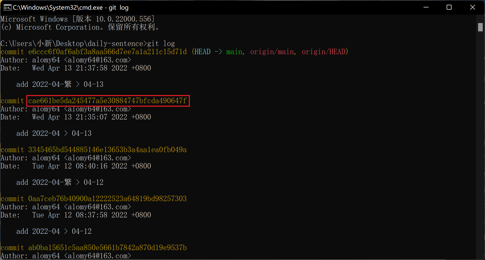
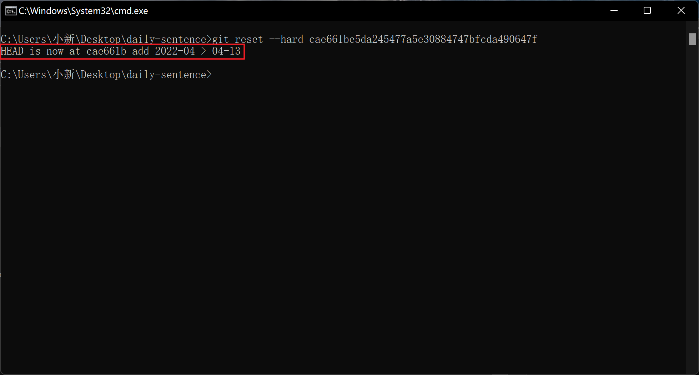

# 04-13

### 1. 实现 代码强制回滚并推送到远程仓库

1. `git log` => 查看 commit 记录，并定位到要回滚的 commit 记录

   

2. `git reset --hard cae661be5da245477a5e30884747bfcda490647f` => 回滚到指定的 commit 记录

   

3. `git push -f` => 强制推送到远程仓库（当前分支）

### 2. 设置 仅适用于当前项目的 user.name、user.email

```js
// set user.name
git config user.name xxx
// set user.email
git config user.email xxx@163.com
```


# 04-15

### 3. **使用git命令提交部分修改代码**

1. git status -s 查看仓库状态

2. git add src/pages/文件名 添加需要提交的文件名（加路径--参考git status 打印出来的文件路径）

3. git stash -u -k 忽略其他文件，把现修改的隐藏起来，这样提交的时候就不会提交未被add的文件

4. git commit -m "哪里做了修改可写入..."

5. git pull 拉取合并

6. git push 推送到远程仓库

7. git stash pop 恢复之前忽略的文件（非常重要的一步）


# 04-17

### 4. 解决 文件名称的大小写被修改后，Git 无法检测出修改 的问题

```js
// 执行完之后会自动添加到暂存区 <add>
// git mv 旧文件名 新文件名
git mv test.txt Test.txt
// -f => 强制重命名 若目标已存在，则会覆盖目标文件
git mv -f test.txt Test.txt
```