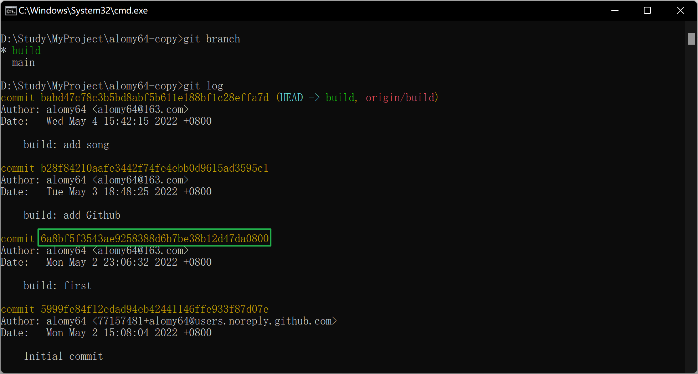
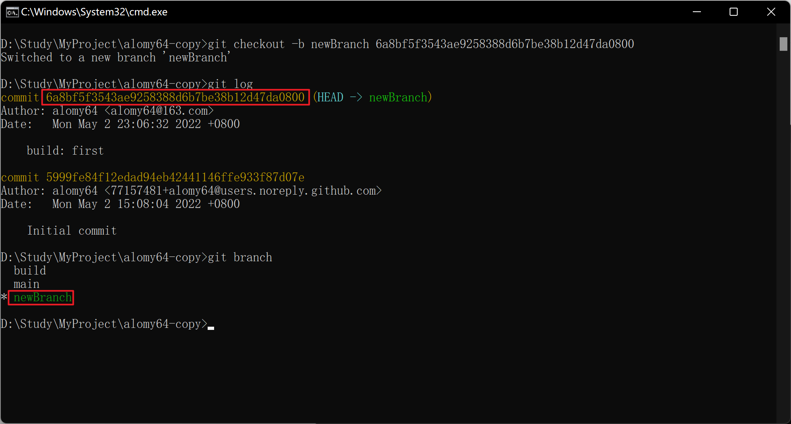

[TOC]

# 05-04

### 1. 基于某次 commit 记录创建新分支

1. `git log` => 查看 commit 记录，确定要基于哪次记录创建新分支

   

2. `git checkout -b newBranch 6a8bf5f3543ae9258388d6b7be38b12d47da0800` => 基于指定的 commit 记录创建分支(newBranch 为分支名)，并切换到此分支

   