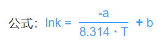

[TOC]

# 05-01

### 1. 高阶函数

- 定义：如果一个函数接受另一个函数作为参数，那么我们就称该函数为高阶函数

- JavaScript 中常见的高阶函数

  - `forEach`、`map`、`reduce`、`filter` 等

  - 具体实现

    - forEach

      ```js
      // 实现
      Array.prototype.myForEach = function (callback) {
        var len = this.length;
        if (typeof callback !== "function") {
          throw new Error("must be function");
        }
        for (var i = 0; i < len; i++) {
          callback.call(this, this[i], i);
        }
      };
      
      // 运用
      var arr = [1, 2, 3];
      arr.myForEach((item) => {
        item = item * 2;
      });
      ```

    - map

      ```js
      // 实现
      Array.prototype.myMap = function (callback) {
        var len = this.length;
        var arr = [];
        if (typeof callback !== "function") {
          throw new Error("must be function");
        }
        for (var i = 0; i < len; i++) {
          arr.push(callback.call(this, this[i], i));
        }
        return arr;
      };
      
      // 运用
      var arr = [1, 2, 3];
      const mapResult = arr.myMap((item) => item * 2);
      ```

    - filter

      ```js
      // 实现
      Array.prototype.myFilter = function (fn) {
        var _newArray = [];
        var len = this.length;
        for (var i = 0; i < len; i++) {
          if (fn.call(this, this[i], i)) {
            if (typeof this[i] === "object") {
              _newArray.push(Object.create(this[i]));
            } else {
              _newArray.push(this[i]);
            }
          }
        }
        return _newArray;
      };
      
      // 运用
      var arr = [1, 2, 3, 4, 5, 6];
      const filterResult = arr.myFilter((current, index) => current % 2 === 0);
      ```

    - reduce

      ```js
      // 实现
      Array.prototype.myReduce = function (fn, init) {
        var i = 0;
        var len = this.length;
        var pre = init;
        if (init == undefined) {
          pre = this[0];
          i = 1;
        }
        for (i; i < len; i++) {
          pre = fn.call(this, pre, this[i], i, this);
        }
        return pre;
      };
      
      // 运用
      // 累加
      var arr = [1, 2, 3];
      const reduceResult = arr.reduce((pre, now, index, arr) => pre + now, 10);
      // type === 'yes' 的 num 相加
      var arr2 = [
        { type: "yes", num: 1 },
        { type: "no", num: 2 },
        { type: "yes", num: 3 },
      ];
      const yesReduceResult = arr2.reduce((pre, current) => {
        if (current.type === "yes") {
          pre += current.num;
        }
        return pre;
      }, 0);
      // vue-router
      var routes = [
        { path: "/", components: "home" },
        { path: "/login", components: "login" },
      ];
      const routeReduceResult = routes.reduce((pre, current) => {
        pre[current.path] = current.components;
        return pre;
      }, {});
      ```

- 编写高阶函数

  - 需要注意的点

    - 保持纯函数，减少函数副作用

    - 调用选择 `call` 还是 `apply`

      call：给回调的参数是指定的数量并且能够找到 

      apply：参数不定，可用 `arguments` 传入

  - 例

    找出对象中符合要求的属性名

    ```js
    function findProperty(obj, fn) {
      var _obj = Object.create(obj);
      var _propertyArr = [];
      for (var key in _obj) {
        if (fn.call(_obj, _obj[key], key)) {
          _propertyArr.push(key);
        }
      }
      return _propertyArr;
    }
    var obj = { num1: 1, num2: 2, nuum3: 3, num4: 4, num5: 5, num6: 6 };
    const findPropertyResult = findProperty(obj, (value, key) => value % 2 === 0);
    ```

### 2. 函数柯里化

- 定义：把接受多个参数的函数变换成接受一个单一参数（最初函数的第一个参数）的函数，并且返回接受余下的参数，而且返回结果的新函数的技术

- 为什么要柯里化

  - 我们不方便传入参数

    ```js
    // Promice => bind
    function add(num) {
      console.log(num);
    }
    Promise.resolve().then(add.bind(this, 123));
    ```

  - 我们写了一个方法，但是这个方法很多时候调用起来参数是固定的

    ```js
    // 验证表单
    function inputTest(reg, value) {
      if (!reg.test(value)) {
        throw new Error("请输入纯数字");
      }
      console.log(`${value} 验证通过`);
    }
    
    // 是否是纯数字 (有多个表单需要验证)
    // 未柯里化
    inputTest(/^[0-9]*$/, 123);
    inputTest(/^[0-9]*$/, 'hello');
    // 柯里化
    const numberTest = inputTest.bind(this, /^[0-9]*$/)
    numberTest(123)
    numberTest('hello')
    ```

- 如何实现柯里化

  - bind

    ```js
    Function.prototype.myBind = function (thisArg) {
      if (typeof this !== "function") {
        return;
      }
      var _self = this;
      var args = Array.prototype.slice.call(arguments, 1);
      return function () {
        return _self.apply(
          thisArg,
          args.concat(Array.prototype.slice.call(arguments))
        );
      };
    };
    ```

  - 柯里化函数会接受到固定参数，然后在函数内部，返回一个新的函数，接受剩余参数

    ```js
    // 未柯里化
    function a(num1, num2) {
      console.log(num1, num2);
    }
    a(1, 2);
    // 柯里化
    function aCurry(num1) {
      return function (num2) {
        console.log(num1, num2);
      };
    }
    aCurry(1)(2);
    ```


# 05-02

### 3. 防抖

- 为什么要防抖

  有的操作是高频触发的，但其实触发一次就好了

  就是等用户高频事间完了，在进行事件操作

- 应用场景
  - 短时间内多次缩放页面，那么我们不应该每次缩放都去执行操作，应该只执行一次操作
  - 监听输入框输入，不应该每次都去触发监听，应该是用户完成一段输入后，再进行触发

- 如何实现

  - 原理

    事件触发 => 开启一个定时器 => 如果再次触发，则清除上一次的，重新开一个 => 定时到，触发操作

  - Code

    ```js
    function debounce(fn, delay) {
      let timer = null;
      return function () {
        clearTimeout(timer);
        timer = setTimeout(() => {
          fn.apply(this, arguments);
        }, delay);
      };
    }
    
    var inputDom = document.querySelector("input");
    inputDom.oninput = debounce(function (event) {
      console.log(event.target.value);
    }, 500)
    ```


# 05-03

### 4. 节流

- 为什么要节流

  防抖存在一个问题，事件会一直等到用户完成操作后一段时间再操作，如果一直操作，会一直不触发

  某个操作希望上一次的操作完成后再进行下一次，或者希望隔一段时间触发一次

- 应用场景

  一个按钮，点击就会发送请求，也就是 第一次点击就发送，然后上一个请求回来后，才能再发

  如果用防抖的话，用户一直点，那么请求就会一直发不出去

- 如何实现

  - 原理

    事件触发 => 操作执行 => 关闭阀门 => 阀门关闭，后续触发无效 => 一定时间后，阀门打开 => 操作可再次触发

  - Code

    ```js
    function throttle(fn, delay) {
      let valid = true;
      return function () {
        if (valid) {
          setTimeout(() => {
            fn.apply(this, arguments);
            valid = true;
          }, delay);
          valid = false;
        } else {
          return false;
        }
      };
    }
    
    var inputDom = document.querySelector("input");
    inputDom.oninput = throttle(function (event) {
      console.log(event.target.value);
    }, 500);
    ```

### 5. 防抖和节流的异同

- 相同点：都是为了阻止操作高频触发，从而减少性能浪费
- 区别
  - 防抖：是多次触发，但只生效最后一次。适用于只需要一次触发生效的场景
  - 节流：是让操作每隔一段时间才能触发一次。适用于多次触发要多次生效的场景


# 05-06

### 6. 一个页面上有大量的图片（大型电商网站），加载很慢，你有哪些方法优化这些图片的加载，给用户更好的体验

  a. 图片懒加载，滚动到相应位置才加载图片。

  b. 图片预加载，如果为幻灯片、相册等，将当前展示图片的前一张和后一张优先下载。

  c. 使用**CSSsprite**，**SVGsprite**，**Iconfont**、**Base64**等技术，如果图片为css图片的话。

  d. 如果图片过大，可以使用特殊编码的图片，加载时会先加载一张压缩的特别厉害的缩略图，以提高用户体验。


# 05-07

### 7. 理解同步函数和异步函数

- 同步：当一个函数是同步执行时，那么当该函数被调用时不会立即返回，直到该函数所要做的事情全部做完了才返回

  ```js
  // 计算3名同学的100米跑步成绩
  // studentId => 学号; startTime => 起跑时间
  function run(studentId, startTime) {
    // 到达终点的时间
  }
  
  run(001, "12:00");
  // 等待...
  run(001, "12:05");
  // 等待...
  run(001, "12:10");
  // 完成
  ```

- 异步：如果一个异步函数被调用时，该函数回立即返回，尽管该函数规定的的操作任务还没有完成

  ```js
  // 计算3名同学的100米跑步成绩
  let time = 0;
  for (var i = 1; i <= 3; i++) {
    // studentId => 学号; startTime => 起跑时间
    setTimeout(function (studentId, startTime) {
      // 到达终点的时间
    }, time);
    // 下一位同学起跑的时间
    time += 10;
  }
  ```


# 05-09

### 8. Math.exp() 的运用



```js
const a = -2333;
const b = -5.23;
const T = 200;
k = Math.exp(-a / (8.314 * T) + b);
```


# 05-10

### 9. 按照年龄从小到大排序（年龄相同, 则女生在前）

```js
// gender: 0 为女生 1 为男生
const students = [
  { name: "foo", age: 10, gender: 1 },
  { name: "boy", age: 30, gender: 1 },
  { name: "bar", age: 20, gender: 0 },
  { name: "girl", age: 30, gender: 0 },
];

students.sort((a, b) => {
  if (a.age === b.age) {
    return a.gender - b.gender;
  }
  return a.age - b.age;
});
```


# 05-12

### 10. 为什么 `typeof null` 是 `object`

* 因为在 `JavaScript` 中，不同的对象都是使用二进制存储的，如果二进制前三位都是 0 的话，系统会判断为是 `Object` 类型，而 `null` 的二进制全是 0，自然也就判断为 `object`

* 这个 BUG 是初版本的 `JavaScript` 中留下的，扩展一下其他五种标识位：
  *  000 对象
  * 1 整型
  * 010 双精度类型
  * 100 字符串
  * 110 布尔类


# 05-13

### 11. `==` 和 `===` 有什么区别

* `===` 是严格意义上的相等，会比较两边的数据类型和值大小 

  * 数据类型不同返回 `false`

  * 数据类型相同，但值大小不同，也返回 `false`

* `==` 是非严格意义上的相等

  * 两边类型相同，比较大小

  * 两边类型不同，根据下方表格，再进一步进行比较

  ```js
  Null == Undefined => true 
  
  String == Number => 先将 String 转为 Number, 再比较大小 
  
  Boolean == Number -> 先将 Boolean 转为 Number, 在进行比较 
  
  Object == String，Number，Symbol => Object 转化为原始类
  ```


# 05-15

### 12. 操作符 `&&` 的其他用法

```js
const code = 1;
// 当 code 为 1 时, 将 Success 赋值给 message
const message = code === 1 && "Success";
console.log(message); // Success
```

### 13. 检测数据类型 toString.call()

```js
const a = "hello",
  b = 1,
  c = true,
  d = undefined,
  e = null,
  f = { name: "Alomy" },
  g = [1, 2],
  h = function () {
    return "Function";
  };
console.log(toString.call(a)); // [object String]
console.log(toString.call(b)); // [object Number]
console.log(toString.call(c)); // [object Boolean]
console.log(toString.call(d)); // [object Undefined]
console.log(toString.call(e)); // [object Null]
console.log(toString.call(f)); // [object Object]
console.log(toString.call(g)); // [object Array]
console.log(toString.call(h)); // [object Function]
```


# 05-16

### 14. 内存泄露、垃圾回收机制

* 什么是内存泄漏

  内存泄露是指不再用的内存没有被及时释放出来，导致该段内存无法被使用

* 为什么会导致内存泄漏 

  内存泄漏指我们无法在通过 `JS` 访问某个对象，而垃圾回收机制却认为该对象还在被引用，因此垃圾回收机制不会释放该对象，导致该块内存永远无法释放，积少成多，系 统会越来越卡,以至于崩溃 

* 垃圾回收机制都有哪些策略

  * 标记清除法

    垃圾回收机制获取根并标记他们，然后访问并标记所有来自它们的引用，然后在访问这些对象并标记它们的引用… 如此递进，结束后若发现有没有标记的（不可达的）进行删除，进入执行环境的不能进行删除 

  - 引用计数法

    当声明一个变量并给该变量赋值一个引用类型的值的时候，该值的计数 +1，当该值赋值给另一个变量的时候，该计数 +1，当该值被其他值取代的时候，该计数 -1，当计数变为 0 的时候，说明无法访问该值了，垃圾回收机制清除该对象