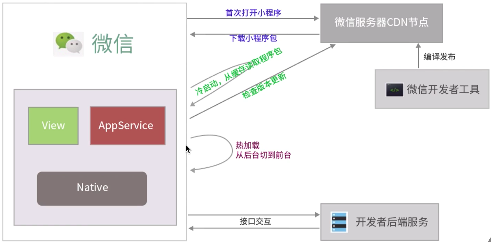

[TOC]

# 08-23

### 1. 小程序的启动机制

- 冷启动
  1. 首次打开
  2. （销毁关闭），再次打开
  3. 重新加载启动
- 热启动
  1. 已经打开过
  2. （一定时间），再次打开
  3. 无需重新启动

# 08-24

### 2. 小程序的双线程架构

为了安全和管控，小程序使用双线程执行：视图线程 和 逻辑线程。

- View 视图线程
- App Service 逻辑线程

# 08-28

### 3. 小程序的三种启动方式

