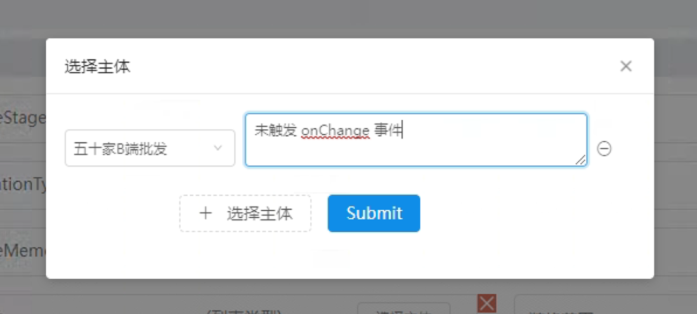

[TOC]

# 09-01

### 1. React 中带有缓存功能的 Github 库，类似于 Vue 的 `keep-alive`

- https://github.com/CJY0208/react-router-cache-route
- https://github.com/CJY0208/react-activation


# 09-28

### 2. 解决 `textarea` 中 `onChange` 事件无响应 的问题

* BUG

  1. `select` 和 `textarea` 都用了 `onChange` 事件

  2. 先选 `select`，后填 `textarea`，`onChange` 事件无响应

  3. 先填 `textarea`，后选 `select`，则正常执行

     

* 解决

  将 `textarea` 的 `onChange` 事件改为 `onInput` 事件即可，所以要灵活运用 `onInput` 和 `onChange`

  ```react
  // 修改前
  <TextArea
    placeholder="请输入..."
    onChange={(e) => this.handleOnChange(e)}
  />
  
  // 修改后
  <TextArea
    placeholder="请输入..."
    onInput={(e) => this.handleOnChange(e)}
  />
  ```