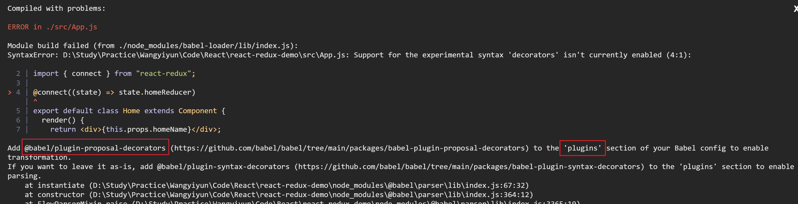
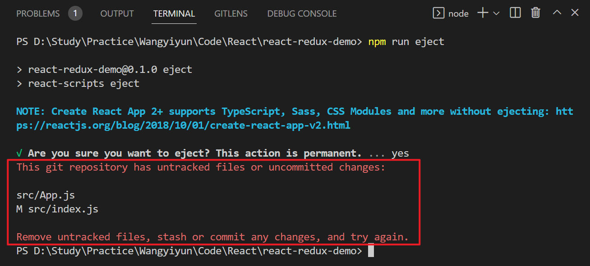

[TOC]

# 12-11

### 1. 解决 React 中使用 `@connect` 出现报错的问题

* 复现
  * App.js：`@connect`

    ```js
    import React, { Component } from "react";
    import { connect } from "react-redux";
    
    @connect((state) => state.homeReducer)
    export default class App extends Component {
      render() {
        return <div>{this.props.homeName}</div>;
      }
    }
    ```

  * 出现报错：`@babel/plugin-proposal-decorators`

    

* 解决

  1. 终端执行命令：`npm run eject`

     遇到报错：提交未提交的更改。

     

  2. 新建文件：babel.config.json，并键入以下代码。

     ```json
     {
       "presets": ["react-app"],
       "plugins": [
         [
           "@babel/plugin-proposal-decorators",
           {
             "legacy": true
           }
         ]
       ]
     }
     ```

  3. 重新启动，正常运行。