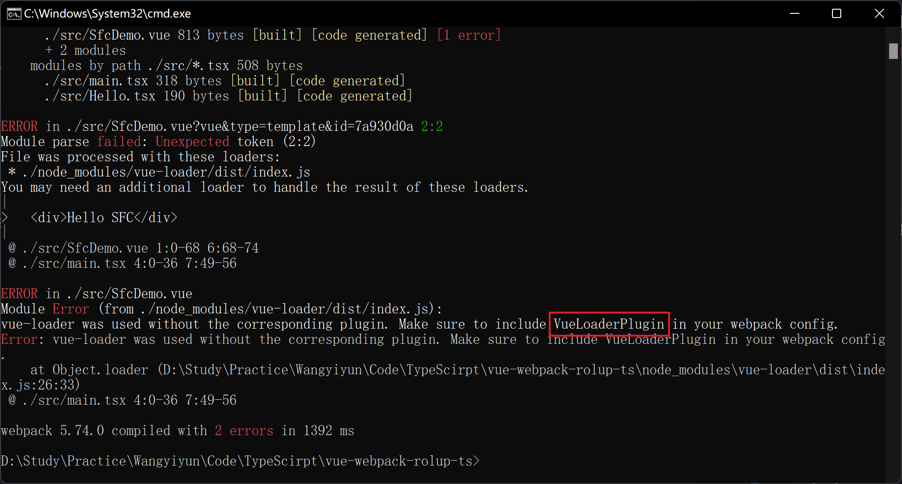
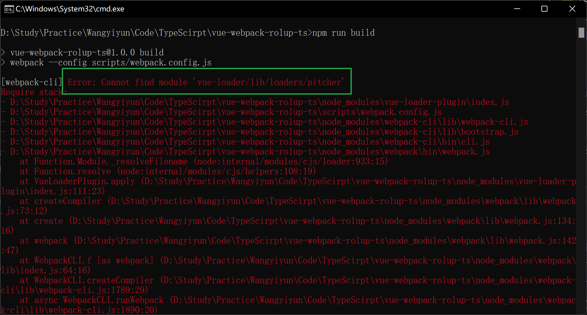

[TOC]

# 08-07

### 1. 遇到配置报错

* 问题及解决方法

  1. 搭建 Vue 项目时，在配置完 `webpack.config.js` 文件后，执行打包命令，结果出现报错，以为是插件未安装导致的报错，便装了 `vue-loader-plugin` 插件。

     

  2. 装完之后，稍加配置，再次执行，依然报错，然后以为是 `vue-loader` 的版本问题，便将版本升级或降级，但报错依旧。

     webpack.config.js

     ```js
     const VueLoaderPlugin = require("vue-loader-plugin");
     
     module.exports = {
       plugins: [
         new VueLoaderPlugin(),
       ],
     }
     ```

     

  3. 最后去 `vue-loader` 官网查看，找到原因，原来 `VueLoaderPlugin` 可以在 `vue-loader` 中拿到，不需要额外再安装 `vue-loader-plugin` 插件。

     webpack.config.js

     ```js
     const { VueLoaderPlugin } = require('vue-loader')
     
     module.exports = {
       plugins: [
         new VueLoaderPlugin(),
       ],
     }
     ```

- 思考

  其实好多问题都可以在官方文档中找到方法解决，所以勤看文档并理解真的很重要。