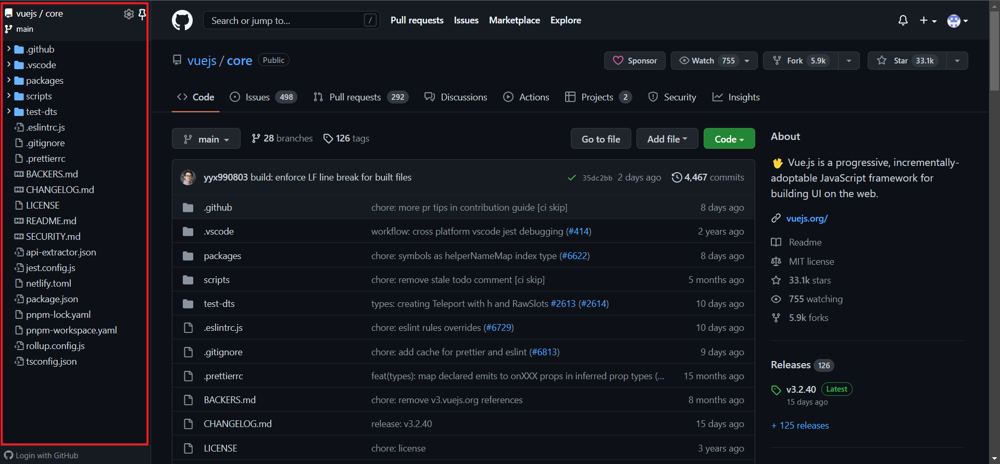

[TOC]

# 10-03

### 1. Chrome 扩展插件：JSONVue

- Github：https://github.com/gildas-lormeau/JSONVue
- 在 Chrome 中访问 URL 地址，使返回的 JSON 数据按照 JSON 格式展现出来。

### 2. 在线文本比较工具

https://www.qianbo.com.cn/Tool/Text-Difference/

# 10-06

### 3. 简繁字体在线互转

https://jf.homefont.cn/

# 10-07

### 4. 颜色 相关

https://www.colorhexa.com/color-names

### 5. Emoji 大全

https://www.emojiall.com/zh-hans

# 10-08

### 6. unicode

https://unicode-search.net/unicode-namesearch.pl?term=STAR

# 10-13

### 7. Github 树形菜单插件

https://www.crxsoso.com/webstore/detail/bkhaagjahfmjljalopjnoealnfndnagc

