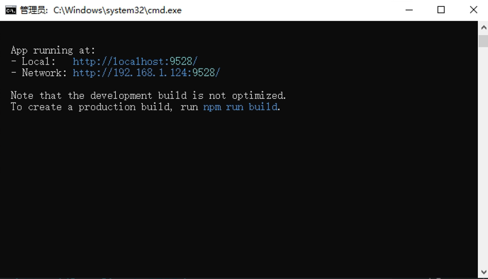
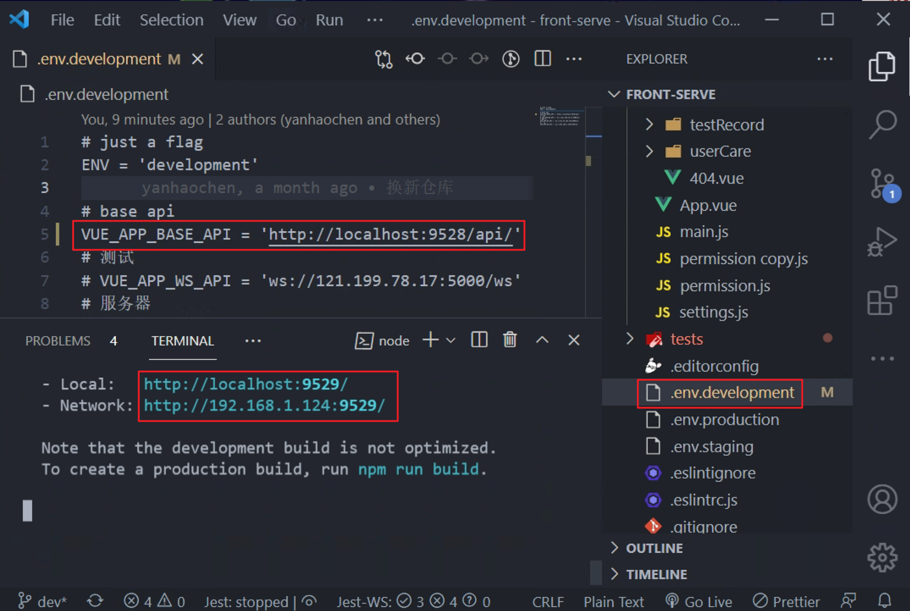
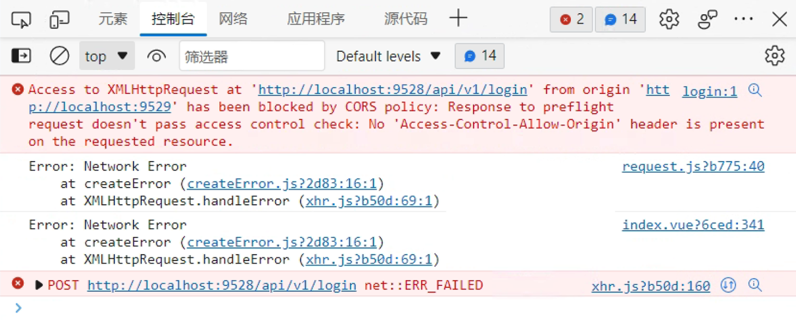
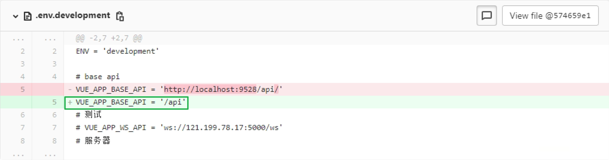
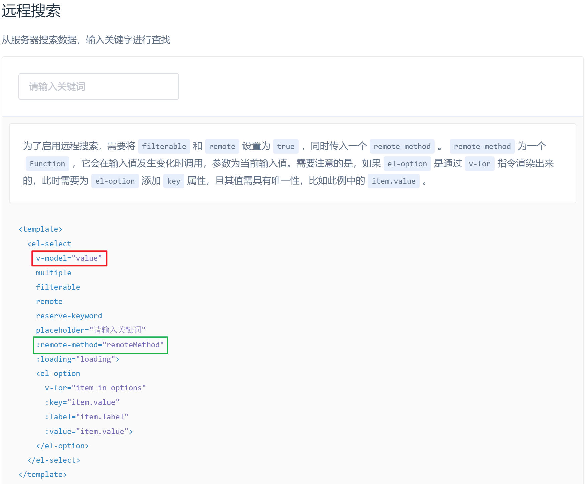
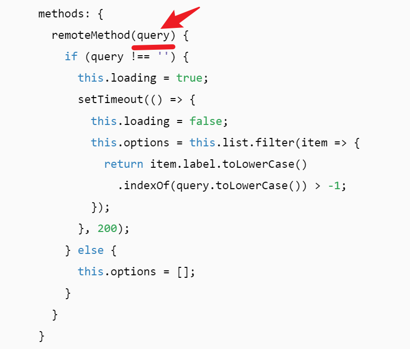
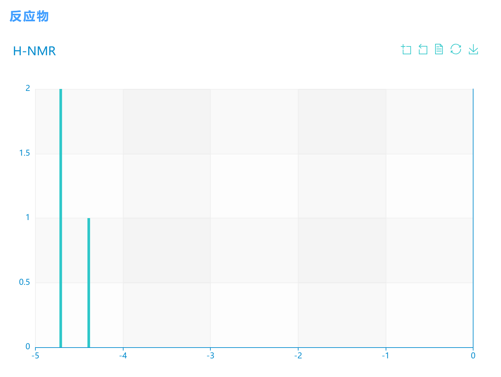
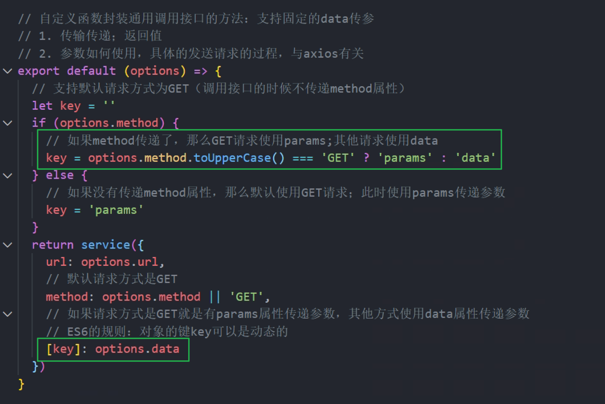

# 04-13

### 1. `el-input` 自定义规则检验时，错误提示信息为 `Error`，而不是自定义的

```js
// 整数 验证
const validateInt = (rule, value, callback) => {
  const intReg = /^-?[0-9]\d*$/;
  if (intReg.test(value)) {
    callback();
  } else {
    // 修改前 =>
    // callback(new Error("请输入整数"))

    // 修改后 =>
    callback("请输入整数");
  }
};
```


# 04-14

### 2. `el-table` 格式化对应列显示的数据

```vue
Template
// Table-column增加属性

  :formatter="formatter"

Data
// 定义相对应的变量数据

  defaultTimeLengthSource: {
    1: '注册赠送',
    2: '管理后台',
    3: '会员充消'
  }        

Methods
// 先判断要修改的是哪一列，然后显示要求的数据

  formatter(row, column) {
    if (column.property === 'source') {
      return this.defaultTimeLengthSource[row.source]
    }
  }
```

### 3. `el-table` 实现 表格单行隐藏并滑入隐藏处显示全部 / 多行隐藏

```vue
单行隐藏并滑入隐藏处显示全部
Template
// Table增加属性

show-overflow-tooltip
        
多行隐藏
Template
// Table增加属性

:cell-class-name="tableCellClassName"
        
Style
/* 两行显示，超出省略号代替 */

  /deep/ .multi-overflow-ellipsis > .cell {
    overflow: hidden;
    display: -webkit-box;
    text-overflow: ellipsis;
    -webkit-line-clamp: 2;
    -webkit-box-orient: vertical;
  }
            
Methods
// 给表格不同单元格添加不同的class

  tableCellClassName({ column: {property} }) {
    if (property === 'func_groups') {
      return "multi-overflow-ellipsis";
    }
    return "";
  }
```

### 4. 动态展示多个 `Echarts` 图表并自适应容器大小

1.  安装依赖 `npm install echarts --save`

2. 要使用的 `vue` 文件

   ```vue
   <template>
     <!-- 需求是只显示一个图表，故 :span="24" 显示多个的话可通过改变 span 来实现 -->
     <el-row>
       <el-col
         :span="24"
         v-for="(item, index) in chartData"
         :key="index"
         class="echarts_wrap"
       >
         <div :id="`activaionenergy-${index}`" style="height: 100%"></div>
       </el-col>
     </el-row>
   </template>
   
   <script>
   var echarts = require("echarts");
   require("echarts/theme/macarons"); // 主题
   const animationDuration = 2000; // 动画
   
   export default {
     name: "Echarts",
     data() {
       return {
         // 数组类型，可一次渲染多个图表
         chartData: {
           code: 1,
           message: "success",
           data: [
             {
               name: "No catalyst",
               x: ["THF", "water", "DMSO", "CH2Cl2", "chloroform", "water"],
               y1: ["25.28", "26.36", "26.41", "25.57", "25.35", "26.36"],
               y0: ["25.29", "26.36", "26.41", "25.57", "24.69", "26.36"],
             },
           ],
         },
       };
     },
     methods: {
       // 动态展现图表数据，根据需求适时调用即可
       initActivaionenergyCharts() {
         this.chartData.forEach((item, index) => {
           let { name, x, y1, y0 } = item;
           this.chart = echarts.init(
             document.getElementById(`activaionenergy-${index}`),
             "macarons"
           );
           this.chart.setOption({
             title: {
               text: name,
             },
             legend: {
               data: ["正向反应活化能", "逆向反应活化能"],
             },
             tooltip: {
               trigger: "axis",
               axisPointer: {
                 type: "shadow",
               },
               textStyle: {
                 color: "#FFFFFF",
                 decoration: "none",
                 fontFamily: "Verdana, sans-serif",
                 fontStyle: "italic",
                 fontWeight: "bold",
               },
             },
             grid: {
               top: 60,
               left: "2%",
               right: "2%",
               bottom: "3%",
               containLabel: true,
             },
             xAxis: [
               {
                 type: "category",
                 data: x,
                 axisTick: {
                   alignWithLabel: true,
                 },
               },
             ],
             yAxis: [
               {
                 type: "value",
                 axisTick: {
                   show: false,
                 },
               },
             ],
             series: [
               {
                 name: "正向反应活化能",
                 type: "bar",
                 data: y1,
                 animationDuration,
               },
               {
                 name: "逆向反应活化能",
                 type: "bar",
                 data: y0,
                 animationDuration,
               },
             ],
           });
         });
         var offsetHeight =
           document.getElementsByClassName("echarts_wrap")[0].offsetHeight;
   
         // 图表自适应窗口大小
         /* window.addEventListener("resize", () => {
           this.chart.resize();
         }); */
   
         // 图表自适应父级容器大小
         this.chart.resize({ height: offsetHeight });
       },
     },
   };
   </script>
   ```

### 5. Vue 与 React 区别？

- 相同点
  - 都支持服务器渲染
  - 都有虚拟 DOM，组件化开发，通过 `props` 参数进行父子组件数据的传递，都实现 `webcomponent` 规范
  - 都是数据驱动视图
  - 都有状态管理，React 有 `redux`；Vue 有 `vuex`
  - 都有支持 Native 的方案，React 有 `React Native`；vue 有 `Weex` 

- 不同点
  - React 严格上只针对 `MVC` 的 view 层；Vue 是 `MVVM` 模式
  -  虚拟 DOM 不一样。Vue 会跟踪每一个组件的依赖关系，不需要重新渲染整个 DOM 组件树；而 React 不同，当应用的状态被改变时，全部组件都会重新渲染，所以 React 中 用 `shouldcomponentupdate` 这个生命周期的钩子函数来控制
  - 组件写法不一样 。React 是 `JSX` 和 `inline style` ，就是把 `HTML `和 `CSS` 全写进 `JS` 中；Vue 则是 `HTML` 、` CSS` 和 `JS` 在同一个文件
  - 数据绑定不一样。Vue 实现了数据双向绑定，React 数据流动是单向的
    - 在 React 中，`state` 对象需要用 `setstate` 方法更新状态；而在 Vue 中，`state` 对象不是必须的，数据由 `data` 属性在 Vue 对象中管理


# 04-19

### 6. `el-table` 中 `formatter` 的使用

- 独自使用

  ```vue
  <template>
  	<!-- 需要格式化值的指定列 -->
  	<el-table-column
      prop="status"
      label="状态"
      :formatter="formatter">
    </el-table-column>
  </template>
  
  <script>
  export default {
    data() {
      return {
        defaultStatus: { 0: "待计算", 1: "计算中", 2: "已完成", 8: "已停止" },
      };
    },
    methods: {
      formatter(row, column) {
        if (column.property === "status") {
          return this.defaultStatus[row.status];
        } else {
          return row[column.property];
        }
      },
    },
  };
  </script>
  ```

- 和 `slot` 一起使用

  ```vue
  <template>
  	<!-- 需要格式化值的指定列 -->
  	<el-table-column prop="status" label="状态">
      <!-- 
        formatter 放在 table-column 的属性位置会失效；
        故放在 template 中使用，v-text 和 v-html 适时使用
       -->
      <template slot-scope="scope">
        <span v-text="formatter(scope.row.status, 'status')" />
  		</template>
    </el-table-column>
  </template>
  
  <script>
  export default {
    data() {
      return {
        defaultStatus: { 0: "待计算", 1: "计算中", 2: "已完成", 8: "已停止" },
      };
    },
    methods: {
      formatter(value, prop) {
        if (prop === "status") {
          return this.defaultStatus[value];
        } else {
          return value;
        }
      },
    },
  };
  </script>
  ```


# 04-21

### 7. 解决 因端口不匹配导致的跨域问题

- **复现问题**

  1. 首先起了一个 9528 的端口

     

  2. 然后又起了一个 9529 的端口，此时，这个端口和 `.env.development` 文件中的 9528 的端口不匹配

     

  3. 最后打开 9529 的页面，报跨域错误

     

- **解决方案**

  修改 `.env.development` 文件中的 `VUE_BASE_API`

  


# 04-24

### 8. `el-select` 远程搜索中 `input` 和 `select` 的相关问题

* `v-model` 绑定的 `value` 只会在 `select` 选择之后改变，`input` 输入的内容不会触发 `value` 的改变

  

* `remote-method` 对应的方法中的参数 `query` 才是 `input` 改变所对应的值

  

### 9. `echarts` 实现 X 轴按值大小有间隔的排列

* 例图

  

* core code

  ```js
  options = {
    xAxis: { type: "value" }, // 要设置成 value 类型，数值轴，为了比较数值大小以及间隔
    series: [
      {
        name: 'H-NMR',
        type: "bar",
        // data 格式要改为 [ [ X, Y ] ]
        data: [
          [-4.71, 2],
          [-4.39, 1],
        ],
        barWidth: 4, // 柱条的宽度，不设时自适应
      },
    ],
  }
  ```


# 04-25

### 10. 解决 使用 `Axios` `GET` 请求时，`params` 参数传递失效 的问题

- error code

  - `api` 下的某个 `.js` 文件

    ```js
    import request from "@/utils/request";
    
    // 获取字典数据
    export function getDictionaryList({ limit, page }, params) {
      return request({
        url: `/v1/dictionary/limit/${limit}/page/${page}`,
        method: "GET",
        params,
      });
    }
    ```

* 失败原因

  `request.js` 中有对 `method` 和 `data`、`params` 相关的处理

  * `utils/request`

    

* 解决方案

  * `api` 下的某个 `.js` 文件

    ```js
    import request from "@/utils/request";
    
    // 获取字典数据
    export function getDictionaryList({ limit, page }, params) {
      return request({
        url: `/v1/dictionary/limit/${limit}/page/${page}`,
        method: "GET",
        // params, // error
        data: params, // success
      });
    }
    ```
