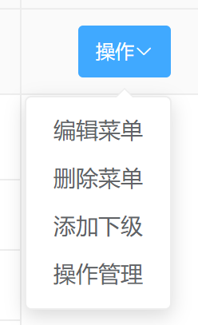

# 10-19

### 1. Vue 中，对 `img` 的 `src` 进行动态判断，但无法正常显示图片？

```vue
<!-- 问题代码 -->


<!-- 解决 require() -->

```


# 10-26

### 2. 下拉框选择时，优化 `if`  `else if` 分支过多的写法



* **template**

  ```vue
  <template>
    <el-dropdown @command="onDropClick($event, row)">
      <el-button size="small" class="ele-btn-icon" type="primary">
        <span>操作</span>
        <i class="el-icon-arrow-down"></i>
      </el-button>
      <template v-slot:dropdown>
        <el-dropdown-menu>
          <el-dropdown-item command="edit">编辑菜单</el-dropdown-item>
          <el-dropdown-item command="del">删除菜单</el-dropdown-item>
          <el-dropdown-item command="add">添加下级</el-dropdown-item>
          <el-dropdown-item command="manage">操作管理</el-dropdown-item>
        </el-dropdown-menu>
      </template>
    </el-dropdown>
  </template>
  ```

* **script**

  * 优化前（`onDropClick` 方法中 `if`  `else if` 分支过多）

    ```vue
    
    <script>
      export default {
        methods: {
          /* 显示编辑 */
          openEdit(row, id) {
          	row ? console.log('编辑') : console.log('添加');
          },
          /* 删除 */
          remove(row) {
          	console.log('删除')
          },
          /* 操作管理 */
          manage(id) {
          	console.log('操作管理')
          },
          
          /* 下拉按钮点击 */
          onDropClick(command, row) {
            if (command == 'add') {
              this.openEdit(null, row.id);
            } else if (command == 'edit') {
              this.openEdit(row);
            } else if (command == 'del') {
              this.remove(row);
            } else if (command == 'manage') {
              this.manage(row.id);
            }
          }
        }
      };
    </script>
    ```

  * 优化后（尽显优雅，已无 `if`  `else if` 分支）

    ```vue
    <script>
      export default {
        methods: {
          /* 显示编辑 */
          openEdit(row, id) {
          	row ? console.log('编辑') : console.log('添加');
          },
          /* 删除 */
          remove(row) {
          	console.log('删除')
          },
          /* 操作管理 */
          manage(id) {
          	console.log('操作管理')
          },
          
          /* 下拉按钮点击 */
          onDropClick(command, row) {
            const targetObj = {
              add: { method: 'openEdit', params: [null, row.id] },
              edit: { method: 'openEdit', params: [row] },
              del: { method: 'remove', params: [row] },
              manage: { method: 'manage', params: [row.id] }
            };
            const { method, params } = targetObj[command];
            this[method](...params);
          }
        }
      };
    </script>
    ```